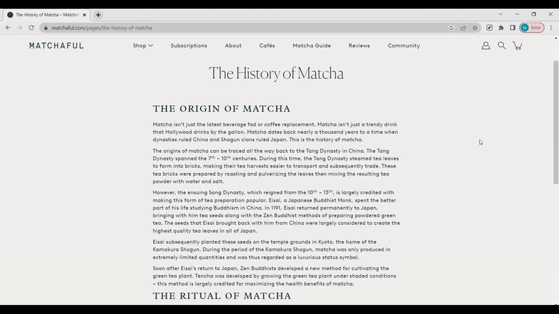

<h1 align="center">
  <br>
   price.gpt 💵
  <br>
</h1>

<h4 align="center">A quick and convenient pricing calculator for using ChatGPT.</h4>

<p align="center">
  <!-- <a href="https://opensource.org/licenses/MIT">
    
  </a> -->
  <a href="https://github.com/jwnicholas99/rpi-rgb-led/releases/">
    
  </a>
  
  
</p>

<p align="center">
  <a href="#key-features">Key Features</a> •
  <a href="#usage">Usage</a> •
  <a href="#development">Development</a>
</p>

<p align="center">

</p>

Price.gpt is a Google Chrome extension that calculates the approximate price of inputting a prompt to ChatGPT.

## Key Features

* Factors in the following when calculating price
    * Base model or fine-tuned model
    * If fine-tuned model, training mode or not
    * Model (Ada, Babbage, Curie or Davinci)
    * Length of input
* Right-click to add selected text to the input textbox
* Persistence of form fields

## Usage
This has not yet been published as a Google Chrome extension as it's still a work in progress. 

## Development
First, clone this Github repo using the following command:
```
git clone https://github.com/jwnicholas99/gpt-price.git 
``` 

Next, go into your Chrome extension settings under "Manage Extensions". Click on "Load unpacked" and choose the repo folder. The extension should now be loaded into your extension menu. 

The three main files to focus on are `popup.html`, `popup.css` and `popup.js`.